# DomHub

> 多云域名与 DNS 统一管理平台

[](https://github.com/onemore-coder/domhub/actions/workflows/ci.yml)
[](https://github.com/onemore-coder/domhub/releases)
[](https://github.com/onemore-coder/domhub/pkgs/container/domhub)
[](LICENSE)

> 🎬 **在线演示**：[domhub-demo.app.workbuddy.host](https://domhub-demo.app.workbuddy.host)（账号 `admin / admin123`，全部为演示假数据，请勿存入真实凭证）

把散落在腾讯云、阿里云、AWS、Cloudflare 等多个云厂商、多个账号下的域名资产和 DNS 解析，收拢到一个控制台里统一管理。单二进制部署，开箱即用。

## 功能特性

- **多云账号接入**：腾讯云 / 阿里云 / AWS / Cloudflare，凭证 AES-256-GCM 加密存储，列表脱敏展示
- **域名台账**：多账号域名统一视图、自动同步、Tags 管理、到期告警（多档提前天数）、托管归属一目了然
- **DNS 解析管理**：跨账号聚合的 Zone 列表（本地缓存秒开）、解析记录增删改、**变更预览 → 确认执行**（diff/plan/push，DNSControl 风格）
- **批量操作与模板**：批量改 TTL / 批量删除，记录模板跨 Zone 一键下发
- **快照与漂移检测**：解析记录定时快照、任意两份快照比较、一键恢复（含 NS 高危强确认）、定时漂移检测告警
- **SSL 证书监控**：自动发现监控主机、TLS 拨测到期时间、多档位告警
- **证书签发与部署**：ACME 免费证书（Let's Encrypt / ZeroSSL，DNS-01，泛域名），自动续期，签发后自动部署到阿里云/腾讯云 CDN 或 SSH 主机
- **告警中心**：到期 / 漂移 / 证书告警，钉钉机器人 / 企业微信 / 邮件 / Webhook / Telegram 渠道，支持测试发送
- **RBAC 权限**：admin / operator / viewer 三角色，可按「账号 + Zone」粒度授权
- **API Token**：`dht_` 前缀令牌，方便接入 CI / 自动化脚本
- **审计日志**：所有 DNS 变更与部署操作留痕（操作人 / 动作 / 内容）
- **两步验证（2FA）**：登录支持 TOTP 动态码（兼容 Google Authenticator 等验证器），管理员可重置
- **现代界面**：浅色 / 深色模式一键切换、全局搜索、系统设置 cron 热生效

## 界面预览

> 以下截图均为演示数据（example.com 等保留域名），不含真实资产信息。

**仪表盘**：资产总览、厂商分布、30 天到期时间线、最近变更（浅色 / 深色）

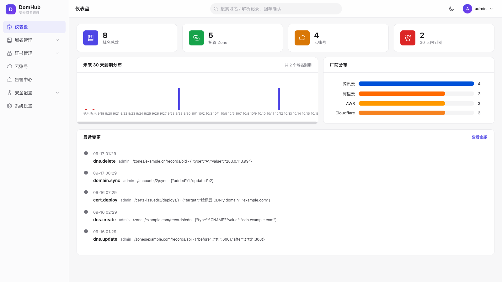
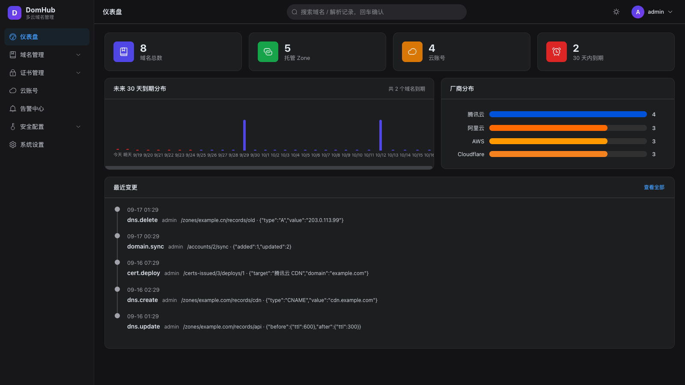

**域名台账**：到期色阶预警、标签管理、解析托管归属

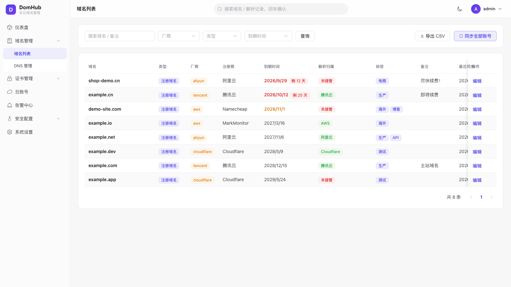

**DNS 管理**：跨账号 Zone 聚合（本地缓存秒开）+ 解析记录增删改、批量操作、变更预览

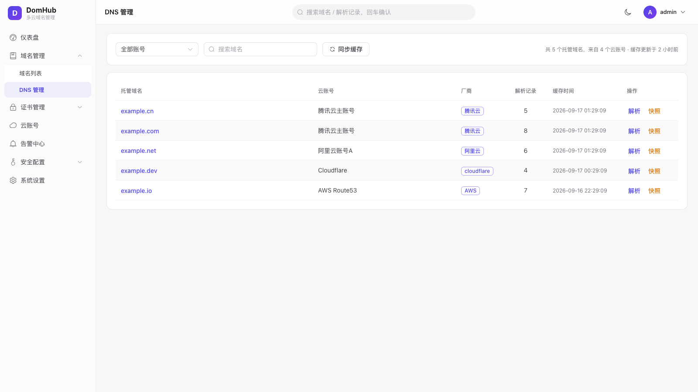
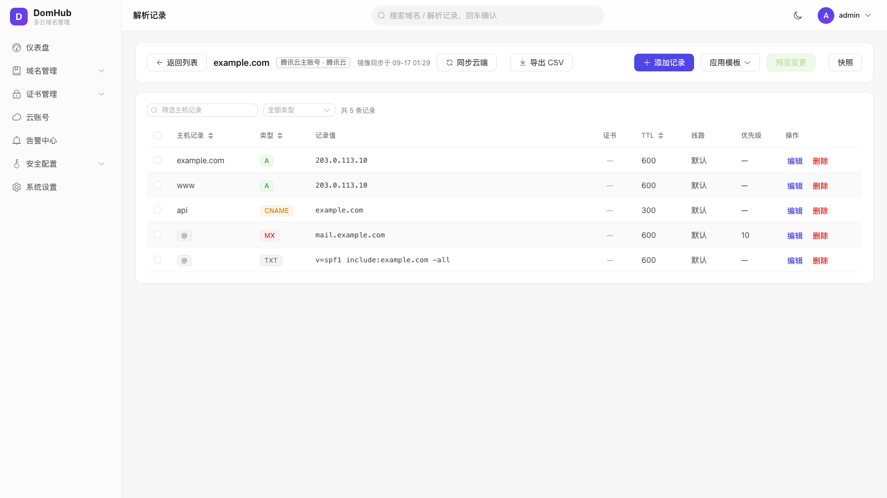

**证书签发与监控**：ACME 免费证书申请（DNS-01 / 泛域名 / 自动续期）、主机证书到期拨测

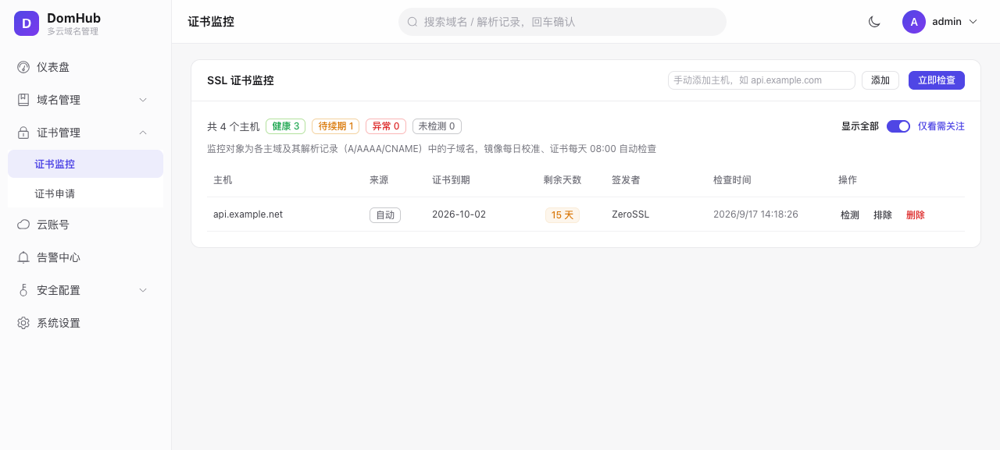
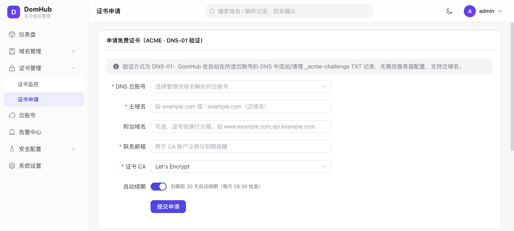

**告警中心**：钉钉 / 企业微信 / 邮件 / Webhook / Telegram 多渠道，多档位提前提醒

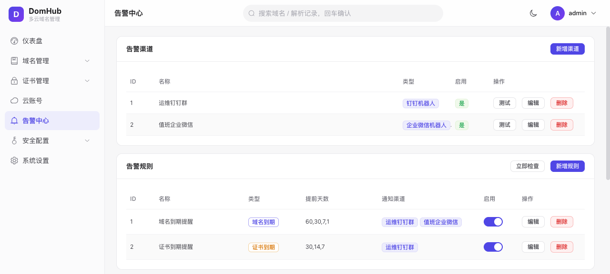

**API Token 与接口目录**：`dht_` 令牌管理，内置全部接口的 curl 示例一键复制

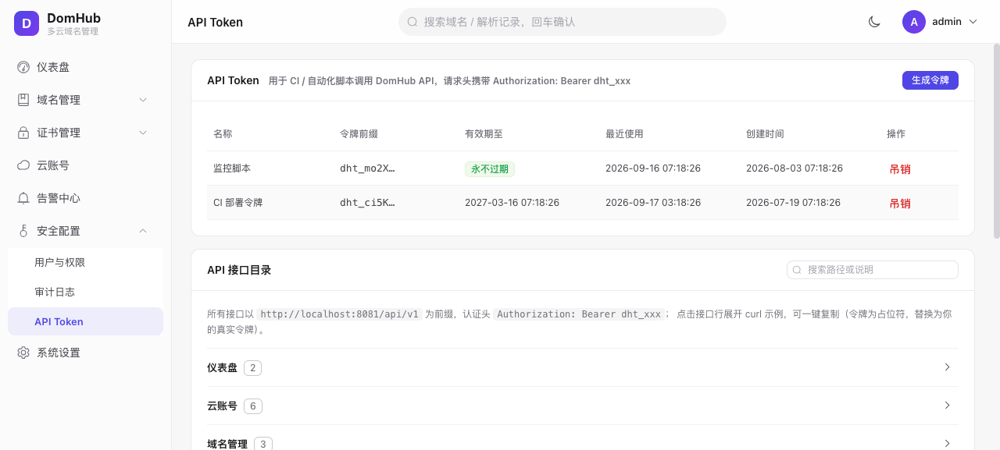

**用户权限 / 审计日志 / 系统设置**：RBAC 三角色 + Zone 级授权、操作全留痕、定时任务 cron 热生效

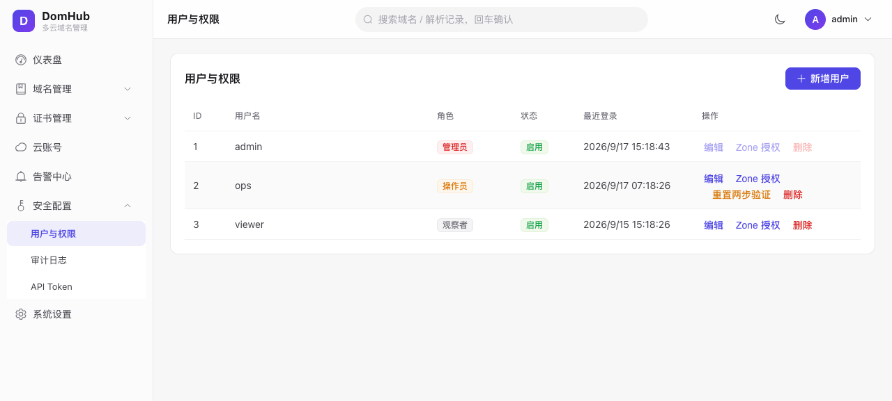
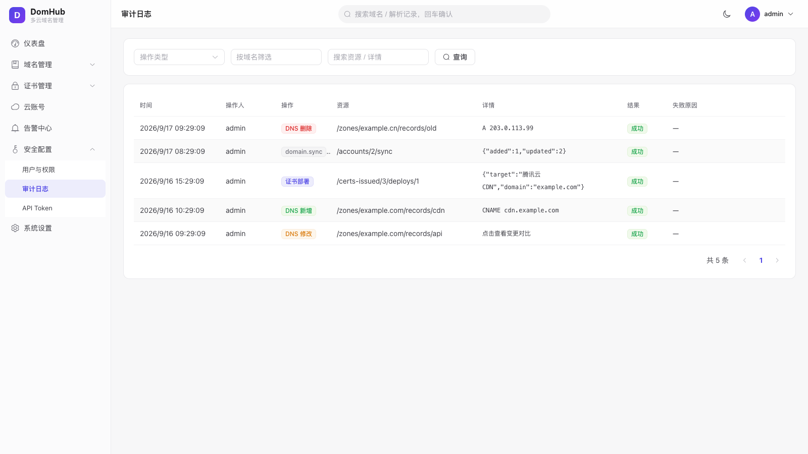
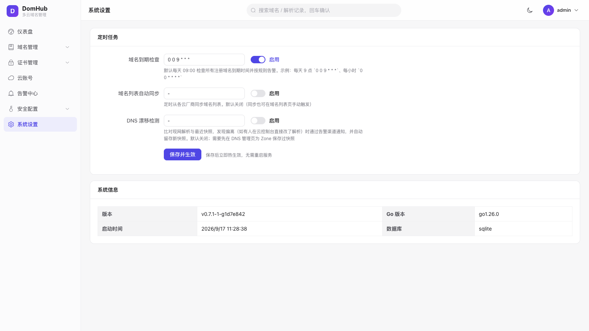

## 技术栈

- **后端**：Go + Gin + GORM（默认 SQLite，可选 MySQL）
- **前端**：Vue 3 + Element Plus + Vite + Pinia
- **部署**：单二进制（`go:embed` 内嵌前端）/ Docker Compose

## 快速开始

### Docker Compose（推荐）

默认单容器 SQLite 部署，无需 MySQL，拉取快、备份只需拷一个数据文件：

```bash
git clone https://github.com/onemore-coder/domhub.git
cd domhub
docker compose up -d
# 访问 http://localhost:8080
```

需要 MySQL（多实例 / 高并发写入场景）时，叠加 MySQL 配置：

```bash
docker compose -f docker-compose.yml -f docker-compose.mysql.yml up -d
```

### 源码构建

```bash
# 构建前端（产物内嵌进二进制）
cd web && npm install && npm run build && cd ..

# 构建后端单二进制（注入版本号，可选）
go build -ldflags "-X github.com/onemore-coder/domhub/internal/pkg/version.Version=$(git describe --tags --always)" -o domhub ./cmd/server

# 默认使用 SQLite（domhub.db），无需 MySQL
./domhub
# 服务监听 http://localhost:8080
```

默认账号 `admin / admin123`，登录后请立即修改。

> **安全提示**：`config.yaml` 中的 `crypto.key` 用于加密云凭证，一旦确定就不要更换，否则已存储的凭证将无法解密。

### 本地开发

```bash
# 后端（默认 SQLite）
go run ./cmd/server

# 前端热更新模式 http://localhost:5173，API 代理到 8080
cd web && npm install && npm run dev
```

### 使用 API Token

在「访问令牌」页签发 Token 后：

```bash
curl -H "Authorization: Bearer dht_xxxxxxxxxxxx" \
  http://localhost:8080/api/v1/domains
```

## Roadmap

| 里程碑 | 内容 | 状态 |
|---|---|---|
| M0 | 项目骨架、JWT 登录、CI / 部署配置 | ✅ |
| M1 | 云账号接入、域名台账、到期告警 | ✅ |
| M2 | DNS 解析管理（preview → push）、审计日志 | ✅ |
| M3 | RBAC、Zone 级授权 | ✅ |
| M4 | 解析快照、漂移检测、Tags、系统设置、OAuth | ✅ |
| M5 | Zone 缓存、API Token、渠道测试发送、体验优化 | ✅ |
| M6 | SSL 证书监控、证书签发（ACME）、证书部署、批量操作模板、全局搜索 | ✅ v0.7.0 |
| v0.7.1 | 两步验证（2FA / TOTP）、配置导出、审计增强、移动端适配、API 接口目录 | ✅ v0.7.1 |
| 之后 | 更多厂商（华为云 / Route53 / 注册商接入）、只读角色细化 | |

完整变更记录见 [CHANGELOG.md](CHANGELOG.md)。

## 项目结构

```
domhub/
├── cmd/server/          # 入口
├── internal/
│   ├── api/             # 路由 / handler / middleware
│   ├── bootstrap/       # 数据库初始化与种子数据
│   ├── job/             # 定时任务调度
│   ├── model/           # GORM 模型
│   ├── provider/        # 腾讯云 / 阿里云 / AWS / Cloudflare 抽象与实现
│   ├── repo/            # 数据访问层
│   ├── service/         # 业务逻辑层
│   └── pkg/             # config / logger / cryptox / notify
├── web/                 # Vue3 + Element Plus 前端
└── .github/workflows/   # CI（构建 / 测试 / tag 发版镜像）
```

## 参与贡献

欢迎 Issue 和 PR，见 [CONTRIBUTING.md](CONTRIBUTING.md)。

## License

[Apache-2.0](LICENSE)
